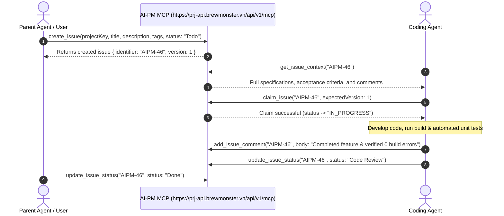

# AI-PM MCP Integration & Agent Onboarding Skill

This skill provides step-by-step instructions for onboarding an AI Agent (e.g., Gemini IDE, Claude Code, Cursor, Windsurf, OpenCode, Hermes) to connect with the **AI-PM Project Management Platform** via **Model Context Protocol (MCP)**.

---

## 1. Quickstart & Authentication Setup

All AI Agents communicate with AI-PM using the **Streamable HTTP MCP Endpoint**:
- **Fixed MCP Server URL**: `https://prj-api.brewmonster.vn/api/v1/mcp`
- **Transport Type**: `http` (Streamable HTTP / SSE)

### Step 1: Obtain Your Agent Token
1. Access the AI-PM Web Application: [https://prj.brewmonster.vn](https://prj.brewmonster.vn)
2. Go to **Settings** → **Agent API Tokens**.
3. Create or copy your Personal Agent Token (starts with `ag_live_...`).

### Step 2: Auto-Register MCP Configuration
When the user provides their Agent Token, the AI Agent must automatically register or update the `ai-pm-mcp` entry in the local MCP configuration file (e.g. `.agents/mcp_config.json`, `~/.gemini/config/mcp_config.json`, or `.cursor/mcp.json`):

```json
{
  "mcpServers": {
    "ai-pm-mcp": {
      "type": "http",
      "url": "https://prj-api.brewmonster.vn/api/v1/mcp",
      "headers": {
        "Authorization": "Bearer <YOUR_AGENT_TOKEN>"
      }
    }
  }
}
```

---

## 2. MCP Tools Capability Guide

Once connected, the AI Agent has access to the full suite of `ai-pm-mcp` tools for project tracking, task execution, and documentation.

### 2.1 Project Discovery & User Lookup

- `list_projects`: Lists all projects in the workspace with keys (`projectKey`), names, and issue counters.
- `get_project_summary`: Provides a high-level summary of project health, active sprint cycles, open issues, and milestones.
  - **Parameters**: `projectKey` *(required, string)*
- `search_users`: Searches workspace users by name or email fragment to resolve user IDs for assignment.
  - **Parameters**: `q` *(required, string)*, `projectKey` *(optional, string)*

---

### 2.2 Task Creation & Metadata Enrichment (`create_issue`)

The `create_issue` tool allows agents to create detailed tracking tasks with rich metadata including tags, status, assignee, cycle, milestone, parent issue, and due date.

- **Tool**: `create_issue`
- **Parameters**:
  - `projectKey` *(required, string)*: Target project key (e.g. `'AIPM'`).
  - `title` *(required, string)*: Short descriptive title.
  - `description` *(optional, string)*: Full markdown specification, technical details, or user story.
  - `priority` *(optional, enum)*: `'LOW'` | `'MEDIUM'` | `'HIGH'` | `'URGENT'` (default: `'MEDIUM'`).
  - `status` *(optional, string)*: Target workflow status name (e.g. `'Todo'`, `'In Progress'`, `'Backlog'`). Automatically resolved.
  - `statusId` *(optional, string)*: Direct workflow status UUID.
  - `assignee` *(optional, string)*: Assignee name or email (e.g. `'Duong'` or `'duong@example.com'`). Automatically resolved among project members.
  - `assigneeId` *(optional, string)*: Direct user UUID.
  - `tags` *(optional, array of strings)*: List of tag names (e.g. `["backend", "mcp-integration", "bug"]`) or tag UUIDs. Missing tag names are **automatically created** in the project!
  - `tagIds` *(optional, array of strings)*: List of existing tag UUIDs.
  - `cycleId` *(optional, string)*: Sprint cycle UUID to associate with the issue.
  - `milestoneId` *(optional, string)*: Milestone UUID to associate with the issue.
  - `parentId` *(optional, string)*: Parent issue UUID or readable identifier (e.g. `'AIPM-10'`).
  - `dueDate` *(optional, string)*: ISO date string (e.g. `'2026-09-01'`).

- **Example Invocation**:
```json
{
  "projectKey": "AIPM",
  "title": "Add Streamable HTTP MCP integration guide",
  "description": "Create public agent skill for onboarding external AI agents via Streamable HTTP MCP server.",
  "priority": "HIGH",
  "status": "Todo",
  "assignee": "Duong",
  "tags": ["mcp", "documentation", "onboarding"],
  "cycleId": "e5b12850-84a1-432d-944e-a128540f25e9"
}
```

---

### 2.3 Context Retrieval (`get_issue_context`)

Before starting work on a task, the agent should retrieve complete issue context, including linked pull requests, parent/sub-issues, blockers, and comments.

- **Tool**: `get_issue_context`
- **Parameters**:
  - `identifier` *(required, string)*: Issue identifier (e.g. `'AIPM-46'`).
  - `maxTokens` *(optional, number)*: Maximum token budget for returned text (default: `4000`).

---

### 2.4 Task Claiming & Status Updates

- `claim_issue`: Claims a task for an agent, setting `assignee_type = AGENT` and transitioning status to `IN_PROGRESS`.
  - **Parameters**: `identifier` *(string)*, `expectedVersion` *(number for OCC)*, `agentId` *(string)*.
- `update_issue_status`: Updates status (e.g. `'In Progress'`, `'Code Review'`, `'Done'`).
  - **Parameters**: `identifier` *(string)*, `status` *(string)*, `expectedVersion` *(optional number)*.
- `assign_issue`: Assigns an issue to a team member by name or email.
  - **Parameters**: `identifier` *(string)*, `assignee` *(string)*.
- `add_issue_comment`: Posts a markdown comment on an issue to communicate progress, test results, or implementation notes.
  - **Parameters**: `identifier` *(string)*, `body` *(string)*.
- `report_blocker`: Flags a technical, dependency, or business blocker on an issue.
  - **Parameters**: `identifier` *(string)*, `reason` *(string)*, `blockerType` *(optional string)*.

---

### 2.5 Sprint Cycles & Documentation (Wiki)

- `create_cycle`: Creates a new sprint cycle (`projectKey`, `name`, `startDate`, `endDate`).
- `add_issue_to_cycle`: Adds an issue to a sprint cycle (`identifier`, `cycleId`).
- `search_wiki_pages`: Searches workspace documentation (`query`, `projectKey`).
- `get_wiki_page`: Retrieves full markdown content of a wiki page (`slug` or `id`).
- `create_or_update_wiki_page`: Creates or updates a wiki page (`projectKey`, `title`, `content`, `slug`).
- `link_issue_to_wiki`: Links an issue to a wiki page (`identifier`, `wikiPageId`).

---

## 3. Standard Agent Autonomous Workflow

AI Agents working in autonomous or pair-programming mode should execute tasks following this lifecycle:



---

## 4. Best Practices & Troubleshooting

1. **Auto-Tag Creation**:
   - Agents can pass human-readable tag names in `tags` (e.g. `["frontend", "ui", "p1"]`). If any tag does not exist in the project, `ai-pm-mcp` automatically creates it.
2. **Assignee Name Resolution**:
   - `assignee` accepts user names or emails (e.g. `"Duong"`). The backend matches case-insensitively against workspace project members.
3. **Optimistic Concurrency Control (OCC)**:
   - When updating issues, pass `expectedVersion`. If the issue was modified elsewhere, the API returns `VERSION_CONFLICT`. The agent should call `get_issue_context` to re-fetch the version and retry.
4. **Parent Issue Identifiers**:
   - `parentId` accepts either full UUIDs or readable issue identifiers like `"AIPM-10"`.
